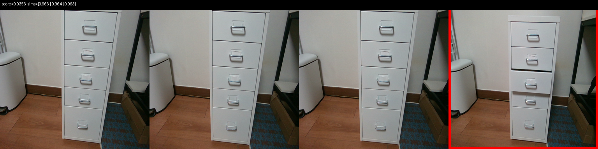
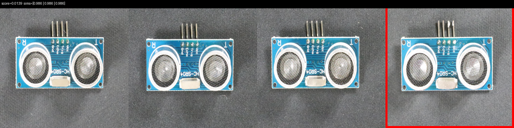
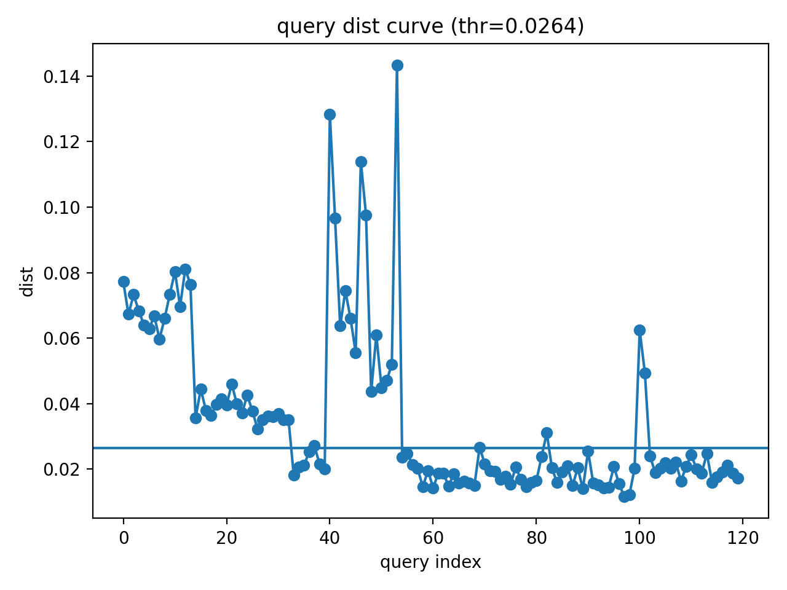

# 🔎 Scene Anomaly Detection (k-NN Embedding Based)

본 프로젝트는 **DINO feature embedding + k-NN 거리 기반 이상 감지 시스템**이다.  
순찰 로봇의 장소별 상태 변화를 자동 감지하는 것을 목표로 설계되었다.

---

## ⚙️ Pipeline Overview

Image  
→ DINO Embedding Extraction  
→ Place-specific Reference Bank  
→ k-NN Distance Computation (k=3)  
→ Adaptive Threshold (Percentile Calibration)  
→ Anomaly Detection  

---

## 📈 Industrial Dataset Evaluation (VisA)

- k = 3  
- Adaptive threshold 적용  

**Overall Performance (Representative Range)**  
- Accuracy: ~85–90%  
- Precision: High tendency  
- Recall: Lower for small/local defects  

> Global CLS embedding 기반 방식은 작은 국소 결함에 둔감한 한계 존재

---

## 🏭 Real Patrol Environment Evaluation

- Total: 120 images (Normal 67 / Anomaly 53)  
- k = 3  
- Adaptive threshold 적용  

**Results**
- Accuracy: **90.83%**
- Recall: **88.68%**
- Precision: **90.38%**
- F1 Score: **89.52%**

→ 실제 순찰 환경 적용 가능성 확인

---

## 📷 Demo Examples

  

  

  

  

---

## 🛠️ Tech Stack

- PyTorch
- DINO (Self-supervised Vision Transformer)
- NumPy / Scikit-learn
- OpenCV

---

## 🚀 Future Work

- Patch-level anomaly localization  
- RGB-D 기반 구조 변화 감지  
- ROS 연동 실시간 파이프라인 통합  

---

## 📚 References

- Deep Nearest Neighbor Anomaly Detection — NeurIPS 2022  
- An Anomaly Detection System via Moving Surveillance Robots with Human — IROS 2021  
- Semantic Scene Difference Detection in Daily Life Patroling by Mobile Robots using Pre-Trained Large-Scale Vision-Language Model — ICRA 2024  

./run_servers.sh

cd sentrynexcontrol
flutter run -d linux