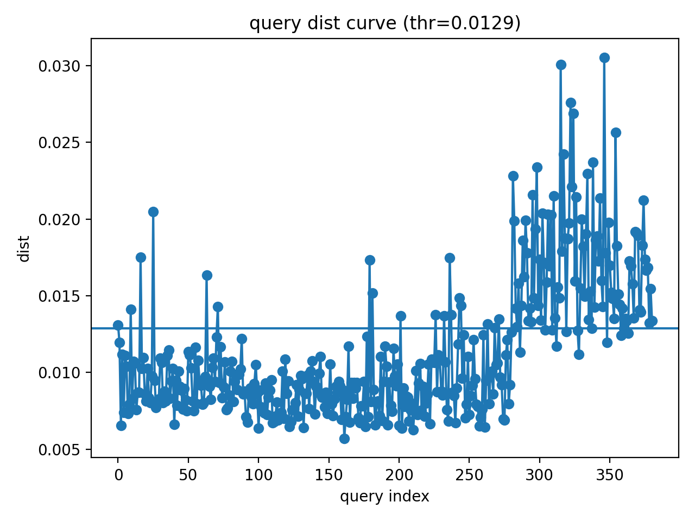

## 🔎 k-NN 기반 이상 감지 (Scene Anomaly Detection)

본 프로젝트는 **k-NN 임베딩 거리 기반 이상 감지(Anomaly Detection)** 시스템을 구현한 코드이다.

이미지로부터 **DINO feature embedding **을 추출하고, 정상 데이터로 구성된 **place-specific reference bank**와의 k-NN 거리 비교를 통해 이상 여부를 판단한다.

또한 데이터 및 환경 변화에 대응하기 위해 **Adaptive Threshold(Percentile calibration)** 기반 자동 임계값 설정을 적용하여 안정적인 이상 감지를 수행한다.

본 파이프라인은 **순찰 로봇의 장소별 상태 감지**를 목표로 설계되었으며, 모델 개발 및 검증을 위해 **VisA 산업 이상 데이터셋**과 실제 순찰 환경에서 수집한 데이터를 사용하였다.

---

## ⚙️ Pipeline Overview

Image  
→ DINO Embedding Extraction  
→ Place-specific Reference Bank  
→ k-NN Distance Computation (k=3)  
→ Adaptive Thresholding (Percentile=97)  
→ Anomaly Detection

---

## 📈 VisA 데이터셋 실험 결과 요약

### 실험 설정 (공통)
- k = 3
- 각 class별 threshold는 th_calib 데이터에서 자동 계산됨

---

### ✅ High-performing Classes (안정적 검출)

#### chewinggum
- Accuracy: **93.36%**
- Recall: **96.00%**
- Precision: **88.89%**
- F1 Score: **92.31%**
- FN이 매우 적어 실제 운용에서도 안정적

#### pcb4
- Accuracy: **92.39%**
- Recall: **89.00%**
- Precision: **83.18%**
- F1 Score: **85.99%**
- 이상을 놓치지 않는 안정적 성능

#### fryum
- Accuracy: **87.92%**
- Recall: **78.00%**
- Precision: **91.76%**
- F1 Score: **84.32%**
- Precision이 높고, 일부 FN 존재

---

### ⚖️ Medium Difficulty Classes (튜닝 여지 존재)

#### candle
- Accuracy: **86.32%**
- Recall: **68.00%**
- Precision: **77.27%**
- F1 Score: **72.34%**
- 정상 다양성으로 인해 일부 오탐 발생

#### pcb1
- Accuracy: **84.78%**
- Recall: **68.00%**
- Precision: **72.34%**
- F1 Score: **70.10%**
- FP와 FN이 모두 존재하여 개선 여지 있음

---

### ⚠️ Hard Classes (Global embedding 한계)

#### macaroni1
- Accuracy: **78.16%**
- Recall: **31.00%**
- Precision: **68.89%**
- F1 Score: **42.76%**
- 대부분의 이상을 놓침 (FN 다수)

#### pcb3
- Accuracy: **81.36%**
- Recall: **40.00%**
- Precision: **78.43%**
- F1 Score: **52.98%**
- 작은 결함에 취약

#### capsules
- Accuracy: **77.32%**
- Recall: **57.00%**
- Precision: **76.00%**
- F1 Score: **65.14%**
- 인스턴스 위치 변화 영향 큼

#### cashew
- Accuracy: **79.17%**
- Recall: **54.00%**
- Precision: **93.10%**
- F1 Score: **68.35%**
- Precision은 높으나 Recall 낮음

---

### 결과 해석 요약

- 대부분 클래스에서 **Precision은 높지만 Recall이 낮아지는 경향** 존재
- 이는 Global CLS embedding 기반 거리 방식이 **작은 국소 결함에 둔감**하기 때문

---

## 📷 Demo Examples (VisA)

  

  

---

## 🏭 실제 순찰 환경 데이터 실험

실제 순찰 환경에서 수집된 데이터에 대해 동일 파이프라인을 적용하여 평가하였다.

### 실험 설정
- k = 3
- 각 place별 threshold는 th_calib 데이터에서 자동 계산됨

### Confusion Matrix

|               | Pred Normal | Pred Anomaly |
|--------------|------------|--------------|
| **Normal**   | 62         | 5            |
| **Anomaly**  | 6          | 47           |

### Evaluation Metrics
- Accuracy: **90.83%**
- Recall: **88.68%**
- Precision: **90.38%**
- F1 Score: **89.52%**
- FPR: **7.46%**
- FNR: **11.32%**

총 120장의 이미지(정상 67, 이상 53)에 대해 평가하였으며, 실제 순찰 환경에서의 적용 가능성을 확인하였다.

---

## 📷 Demo Examples (Real Patrol Environment)

  

  

  

---

---

## 🚀 Future Improvements

- Patch-level anomaly localization
- SAM 기반 object-level scoring
- RGB-D 정합 기반 구조 변화 감지
- 실시간 로봇 시스템 통합

---

## 📚 References

- Deep Nearest Neighbor Anomaly Detection — NeurIPS 2022  
- An Anomaly Detection System via Moving Surveillance Robots with Human — IROS 2021  
- Semantic Scene Difference Detection in Daily Life Patroling by Mobile Robots using Pre-Trained Large-Scale Vision-Language Model — ICRA 2024
