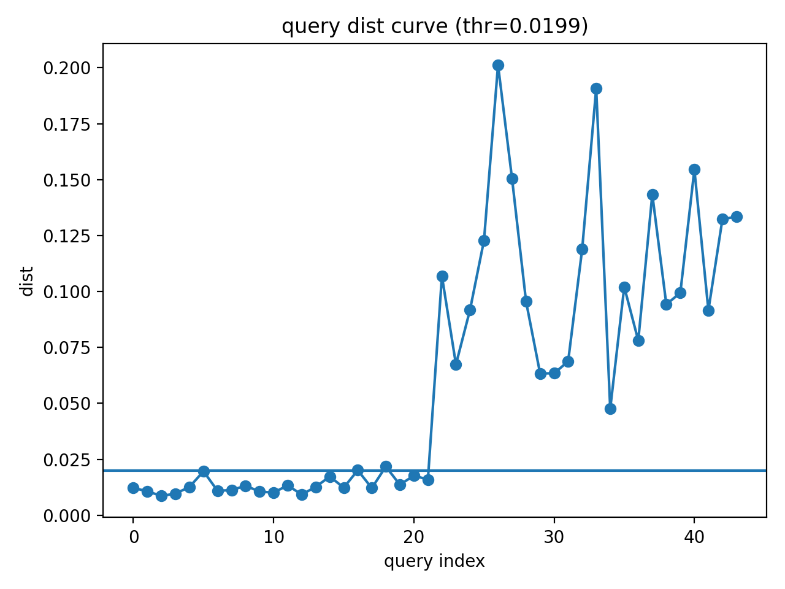

# k-NN 기반 이상 감지

본 프로젝트는 **k-NN 임베딩 거리 기반의 이상 감지(Anomaly Detection)** 를 수행하는 코드이다.

이미지에서 **DINOv3 feature embedding**을 추출하고, 정상 데이터로 구성된 **reference bank**와의 k-NN 유사도(거리) 비교를 통해 이상 여부를 판단한다.  
또한 데이터 및 환경에 따라 자동으로 임계값을 설정하는 **Adaptive Threshold** 방식을 적용하여 보다 안정적인 이상 감지를 수행하도록 하였다.

본 파이프라인은 **순찰 로봇의 장소(place)별 상태 감지**를 목표로 디자인되었으며, 모델 개발 및 검증, 특성 확인을 위해 **MVTec AD** 및 자체 제작 데이터셋을 통해 실험하였다.

---

## MVTec AD 실험 요약

MVTec AD의 일부 클래스에 대해 테스트했으며, 클래스별 난이도 편차가 크게 나타났다.

- **Easy (높은 성능)**: `grid`, `hazelnut`  
  - F1 약 **94~97** 수준, FPR 낮음

- **Medium (튜닝으로 개선 가능)**: `cable`, `bottle`, `toothbrush`  
  - F1 약 **84~85** 수준, 일부 클래스에서 정상 오탐(FPR) 증가

- **Hard (global embedding 한계)**: `screw`, `transistor`  
  - 작은/미세 결함에서 recall이 크게 떨어지는 경향  
  - patch-level scoring 등 추가 개선 필요

> 본 결과는 **global embedding 기반 k-NN**의 전형적인 특성(작은 결함에 약함)을 반영한다.

---

## 📷 데모 화면

  

  

---

## 주요 기능

- Feature embedding 기반 k-NN anomaly detection
- Reference bank 기반 정상 데이터 임베딩 관리
- cosine similarity 기반 anomaly score 계산
- **Adaptive Threshold 기반 자동 임계값 설정**

- Accuracy, Precision, Recall, F1 등 평가 metric 계산

---

