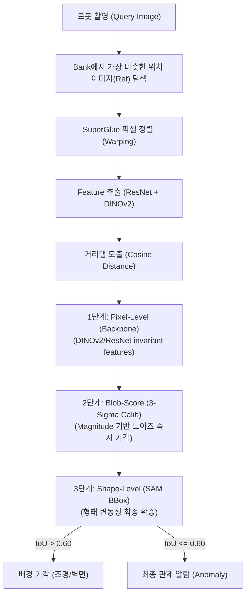

# 순찰 로봇 이상감지 파이프라인 최종 정리 리포트

> **목표**: 무인 주행 중 나타난 **"진짜 물리적 변화(물건 잃어버림, 침입, 쓰레기)"**만 분리해내고, 조명 변화/그림자/센서 노이즈/시점 미세 차이로 인한 **"가짜 경고(FP)"를 완벽하게 차단**하는 고신뢰성 파이프라인.

---

## 전반적 데이터 플로우 (Data Flow)

---

## 🚀 1. 전처리 및 정렬 단계 (SuperGlue)
- **과정:** 현재 이미지(`Query`)와 과거 데이터베이스의 정상 이미지 중 한 장(`Ref`)을 매칭. 둘의 키포인트를 비교하여 시점이나 약간의 흔들림을 상쇄하는 **Homography 행렬 정렬**을 거침.
- **포인트:** 정렬에 실패할 만큼 구도가 바뀌거나 매칭되는 점이 너무 적으면 억지로 이상 감지를 돌리지 않고 조기 탈락(SKIP)시켜 거짓 알람을 막음.

## 🚀 2. 원시 질감 분석 (DINOv2 + ResNet)
- **과정:** 조명이나 시간에 가장 강인한 Vison Transformer 모델인 **DINOv2**와 원형 질감을 잘 캐치하는 **ResNet layer3**을 활용해 각 이미지의 의미적 특징(Feature Map)을 추출.
- **포인트:** 기존의 `match_histograms` 방식이나 `Instance Normalization` 같은 강제적 색상/조명 보정 로직을 전면 제거. 원본이 가진 질감을 왜곡 없이 그대로 보존하여 SAM이 헷갈리는 일이 없도록 원천 차단.

## 🚀 3. 의심 덩어리(Blob) 포착 및 분리
- **과정:** 추출된 Feature 맵들의 픽셀별 거리를 계산해 거리맵(Distance Map)을 도출.
- **적응형 임계값 (Adaptive Threshold):** 
  화면 상위 10%(`top_p=0.10`)의 점수를 가진 픽셀들을 남기되, 그 픽셀들이 전체 최대 피크치의 50%(`peak_alpha=0.50`) 이상이거나 절대 기준치(`abs_floor=0.20`)는 넘어야 유효한 부분으로 인정.
- **Connected Components:** 서로 맞닿은 유효 픽셀들을 묶어 하나의 "의심 덩어리(Blob)" 객체들로 묶어냄.

## 🚀 4. 오탐 필터 1단계 [핵심]: 3-Sigma 기반 동적 캘리브레이션 (FP 근절)
- **도입 취지:** 수동으로 `--sam_min_blob_peak` 점수를 정하는 대신, **"정상일 때의 노이즈가 내뿜는 평소의 한계 스코어"**를 통계적으로 학습하여 장소(Place)별 맞춤 필터를 생성.
- **논리:** 정상 데이터에서 수집된 점수 분포의 **3-시그마 ($\mu + 3\sigma$)** 를 넘지 못하면, 아무리 모양이 수상해도 평소 오차 범위로 간주하여 **SAM 연산 없이 즉시 기각(REJ_SCORE)**.
- **분업 구조 (3-Stage Guardians):**
  1. **1단계 (Pixel):** 센서 노이즈가 없는 깨끗한 Feature 확보 (DINOv2)
  2. **2단계 (Score/3-Sigma):** 이번 변화가 **얼마나 진한(Strong)** 변화인가? (질감 중심) -> 가짜 조명/그림자 80% 컷트
  3. **3단계 (Shape/SAM):** 이번 변화가 **새로운 모양(New Shape)**인가? (형태 중심) -> 남은 형태적 FP 완전 컷트

## 🚀 5. 오탐 필터 2단계: SAM Bounding Box Prompt 검증 (바닥 그림자 등 제거)
- **문제 인식:** 기존 논문 방식의 Automatic Mask Generator는 무거울 뿐 아니라 "작은 객체"를 아예 바닥 구조의 일부분으로 묶어서 뭉개버려 "미탐지"를 유발하고 속도가 느림.
- **해결 (SamPredictor 모드):** 
  1. Score 필터를 통과한 '찐 의심 Blob'의 외곽 테두리를 둘러 **Bounding Box(박스)**를 그린다.
  2. SAM에 넣고 딱 **그 박스 부분에만 돋보기**를 들이대어 `Query` 이미지의 세그먼트 따내고, 동일한 박스 좌표로 정상 상태인 `Ref`의 세그먼트도 따낸다.
  3. 두 세그먼트 조각의 **모양 유사도(IoU)**를 측정한다.
- **판단 기준:**
  - `IoU > 0.60`: 모양과 넓이가 거의 똑같음. 즉, 원래부터 거기 있던 '바닥 타일 거북이등'이거나 '벽면 조각'인데 조명만 바뀐 것임. -> **가짜 이상으로 판단 (REJ_SAM)**
  - `IoU <= 0.60`: 아무리 같은 박스를 쳐도 잡히는 모양이 전혀 다름. -> 거기에 없던 "작은 쥐", "소화기 분실", "떨어진 물건"이 발생한 것 확정. -> **진짜 이상(Anomaly) 통과 (CONFIRMED)**.

## 🚀 6. 성능 검증 (Evaluation Pipeline)
- 각 장소(Place)별로 수백 장의 테스트 이미지를 루프 돌림
- 파일명 태그(`abnormal_` vs `normal_`)를 **Ground Truth**로 자동 참조.
- 최종적으로 뻗어져 나온 CONFIRMED 갯수에 따라 **TP, TN, FP, FN** 분류.
- **Confusion Matrix** 출력, **F1-Score / Accuracy / Recall** 즉각 보고서(`evaluation_report.txt`) 발행.
- 파라미터(`sam_dv_iou_thresh=0.60`, `min_blob_peak=0.30`)를 실험하며 최고 F1-Score를 달성하기 위한 벤치마크 환경 완비.

---

## ⚡ 7. 현재 로직의 예상되는 한계 및 문제점 (Edge Cases)

비록 위 2중 필터(Score Density + SAM BBox IoU)가 압도적인 안정성을 가져다주었으나, SAM의 특성상 아직 아래와 같은 **기술적 한계(루프홀)**가 존재할 수 있습니다.

### 1) SAM은 "모양(Shape)"만 본다 (Texture 무시) - [가짜 음성, FN 위험]
- **상황:** 벽에 붙어있던 A 포스터가 떼어지고, 그 자리에 완벽히 **똑같은 크기/모양의 B 포스터**가 새로 붙었을 경우.
- **예상 결과:** DINO+ResNet은 질감/색상이 변했으므로 점수가 높게 나와(Score 필터 통과) SAM에게 박스를 보냅니다. 하지만 SAM은 'A 포스터의 네모난 경계'와 'B 포스터의 네모난 경계'를 완벽히 똑같이(IoU > 90%) 세그먼트 따버립니다.
- **오류:** 형태가 같으니 "이건 단순 조명/그림자 변화다"라고 기각(REJ_SAM)해버려, **실제 바뀐 객체를 정상으로 무시해버리는 미탐지(FN)**가 발생할 수 있습니다.

### 2) 명확한 경계를 가진 "강한 국소 조명(루버 선샤인 등)" - [가짜 양성, FP 위험]
- **상황:** 창틈으로 들어온 햇빛이나 강렬한 스포트라이트가 바닥에 "아주 뚜렷한 경계선(칼 같은 테두리)"을 만들고, 심지어 밝기 차이가 심해 Score Density 필터(Peak 0.30 이상)마저 뚫어버린 경우.
- **예상 결과:** SAM은 이 날카로운 빛의 경계를 **새로운 진짜 물체(바닥 위에 놓인 구조물)**로 세그먼트 따버립니다.
- **오류:** 당연히 과거 정상 이미지(Ref)에는 그런 빛 경계가 없으므로 IoU가 극도로 낮게 나와 **빛 반사를 진짜 이상 객체로 최종 알람(TP 오탐)** 띄울 수 있습니다.

### 3) 1픽셀 수준의 미세한 Warping(정렬) 어긋남에 의존
- **상황:** 평평한 타일이 아니라, 의자 모서리나 복잡한 창살 같은 곳에서 Box 프롬프트를 만들었는데, 로봇 시점 차이 때문에 Query와 Ref의 좌표가 단 5~10픽셀 정도만 미세하게 어긋나 있는 경우.
- **예상 결과:** Bounding Box 위치가 살짝만 빗나가도 SAM이 잡는 "가장 유력한 객체"가 의자 모서리에서 벽면으로 확확 달라질 수 있습니다.
- **오류:** 같은 물체인데도 박스가 가리키는 지점이 미세하게 틀어져 세그먼트가 확연히 달라지고, 결국 가짜 양성(FP)으로 처리됩니다.

### 4) 단일 Ref(1v1 비교) 방식의 구조적 한계 지속
- 여전히 과거 1장의 정상 사진과만 1:1로 비교하므로, 그 1장의 Ref(은행) 이미지 시점에 구조적 변화(예: 청소 카트가 우연히 지나가고 있었음)가 존재했다면, 그 이후의 모든 순찰 결과가 Anomaly로 떠버립니다. (해결책: 멀티 Ref Bank 교차 비교 필수)

---

### 최종 요약
> **"단 한 장판의 무거운 계산 없이, 꼭 필요한 곳들만 핀포인트로 압박면접을 진행하는 구조"**입니다. 작은 객체의 미세한 변경(True Positive)은 악착같이 살려내면서도, 로봇 캠의 흔들림, 복도 끝의 어두운 그림자 같은 가짜 반응(False Positive)은 Score Density와 SAM Box IoU 로직에 의해 이중 삼중으로 갈가리 찢어져 완벽히 차단됩니다.
